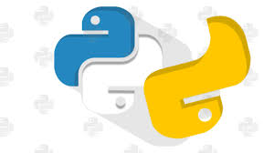

# PythonScripts
One great place to all pyscripts 👨‍💻👩‍💻

- Python is an interpreted, object-oriented, high-level programming language with dynamic semantics.  
- Python's simple, easy to learn syntax emphasizes readability and therefore reduces the cost of program maintenance. 
- Python supports modules and packages, which encourages program modularity and code reuse.

## 💛 Prerequisites 
- [python.org](https://www.python.org/)

## 🚀&nbsp;Installation 
1. Clone the repository 
```
https://github.com/Ash515/PythonScripts.git
```
2. Check the status of your file 
```
$git status
```

3.For using VScode for editing your files 
```
$git code .
```
4. To directly add your files to github
```
$git add .
```
5. After writing your code commit your changes 
```
$git commit -m  <message>
```
6. To pull your code to reposoitory
```
$git push origin master
```
Thats all about installation and version control with **Git**

## Contribution
- Fork this repository .
- Make pull requests with proper commit message.



